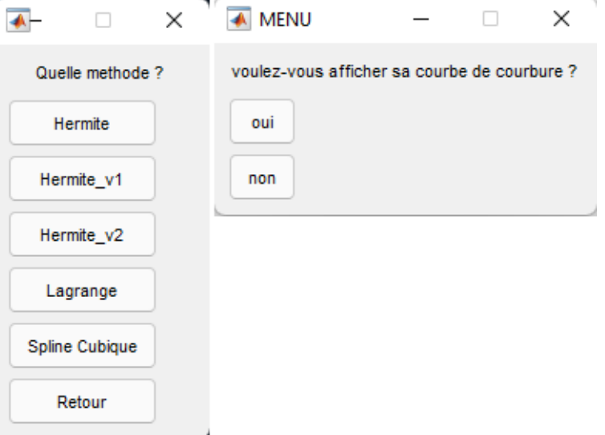
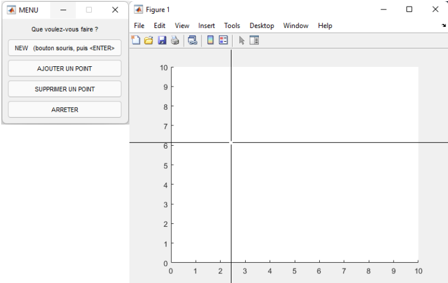
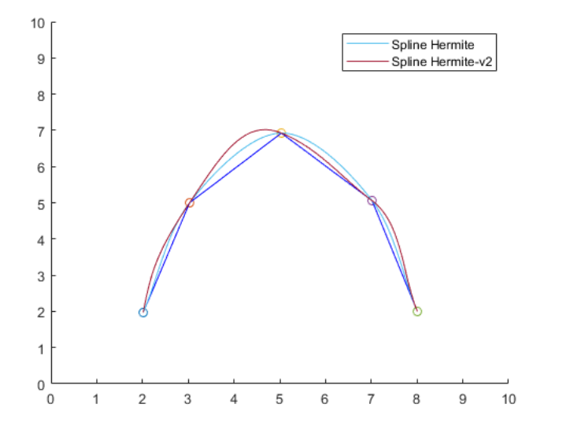
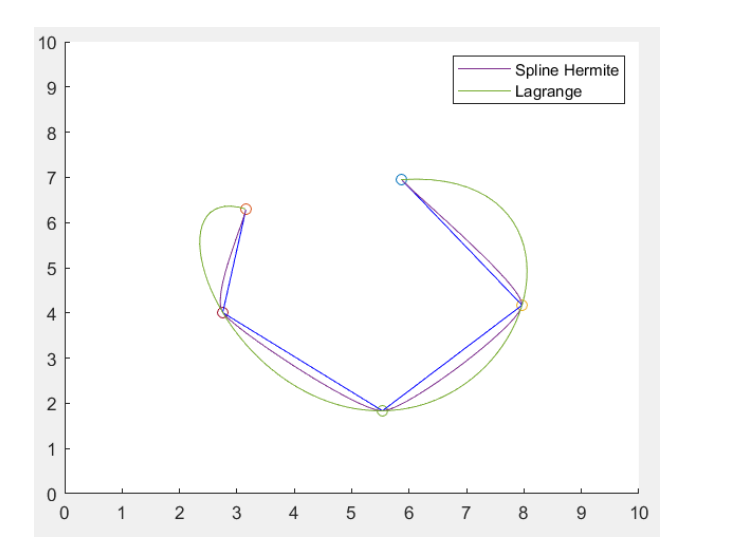
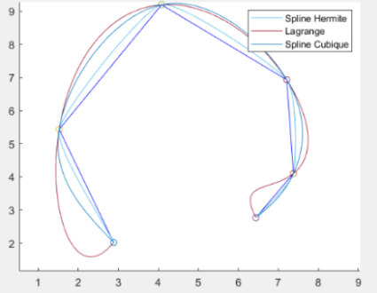

# Geometric-Modeling

The project is interested in modeling parametric curves interpolating the points Pk,
using Hermite cubic splines, with tangents estimated by Cardinal splines at first, then by two other estimates of the tangents (Hermite_v1 and Hermite_v2), then we have moved to Lagrange interpolation, and finally to cubic splines C2 .

## 1/ Demo of the code :

The code is executed by the MAIN.m function, once the program is executed a window opens
allowing to enter the points to be interpolated or to delete a point of the curve .

Then another window will allow you to choose the method by which you want to do the interpolation with the choice to display its curvature curve or not.

###  1 - Example of Hermite and Hermite-v2 :

###  2 - Lagrange and Spline Hermite  :

###  3 - Example of  Lagrange,  Spline Hermite and Spline Cubique C2 :

